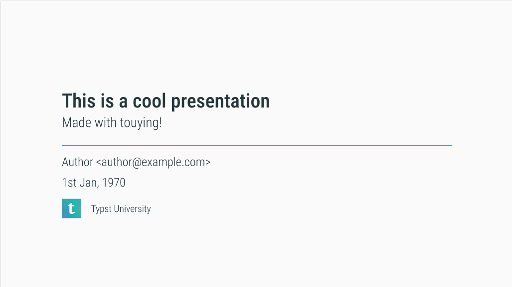
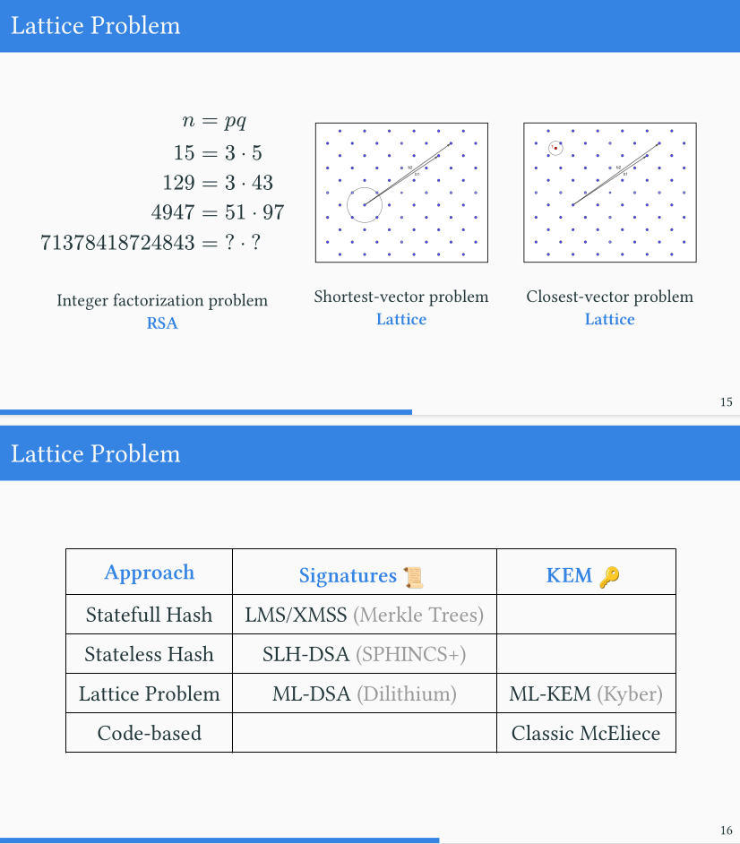
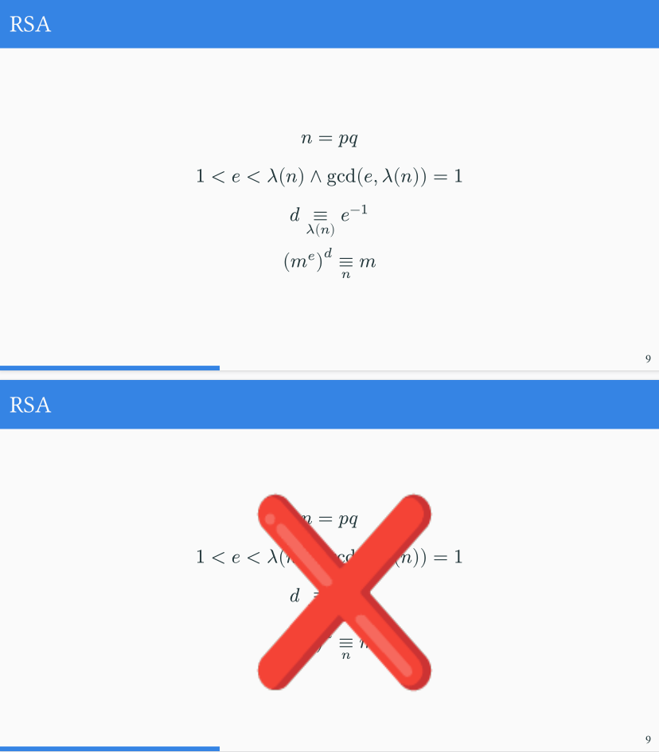
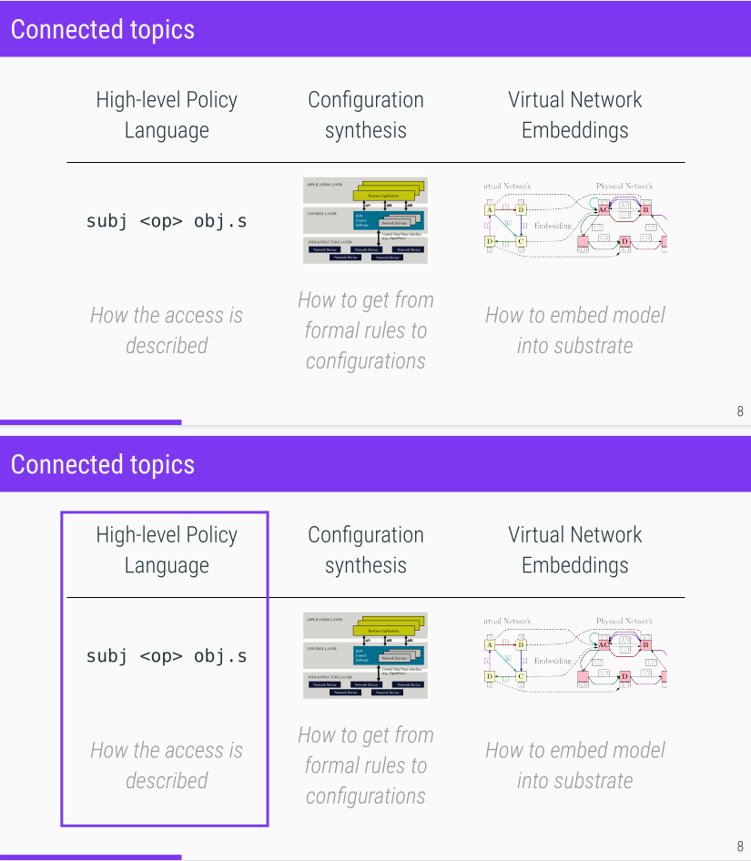
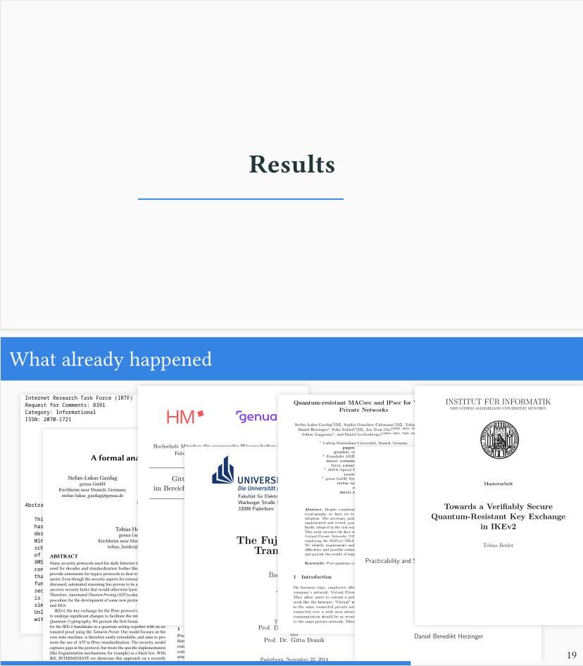
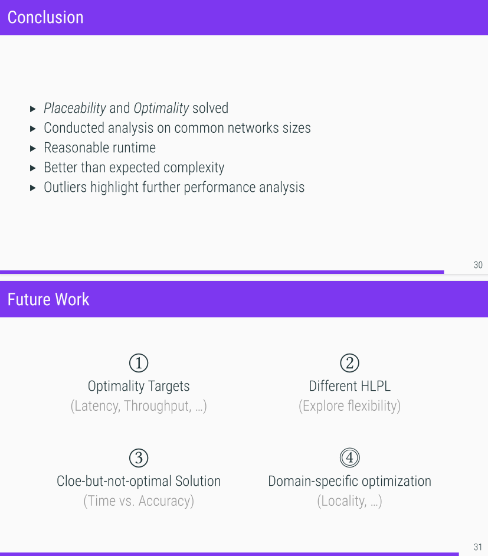
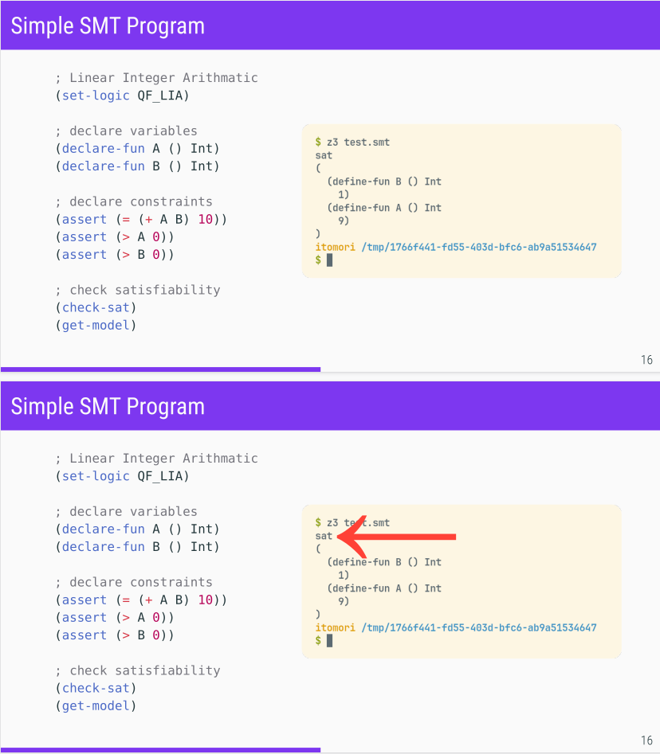

# Clean Touying Presentation

This is a presentation template, using the [Touying](https://touying-typ.github.io/docs/intro/) framework.

The goal was a simple, easy and fast-to-use template, which I can use, without thinking too much about the setup.
In the end, it's just:
- setting some colors for the Metropolis theme
- setting some styling (font, list marker icon, ...)
- enabling speaker notes (using [pympress](https://github.com/Cimbali/pympress))
- providing some helper functions to use common environments with default parameters (grids, ...)


## Features

Thanks to touying, we have:
- title slides
- progression bar
- slide numbering
- [dynamic slides](https://touying-typ.github.io/docs/category/dynamic-slides)
- focus slides
- [speaker notes](https://touying-typ.github.io/docs/external/pympress#speaker-notes)
- ...

If you are not using the `pympress` PDF reader, you can disable the speaker notes by commenting out the `show-notes-on-second-screen` line.

## Usage
+ Adjust title, author, date and affiliation at the top of the file.
+ Optionally adjust the colors, to match affiliation logo color
+ Start hacking the presentation after `// PRESENTATION STARTS HERE...`

Use the provided Nix-flake:

```
$ nix develop .
```

or just the Typst installation on your system:

```
$ typst watch presentation --open
```

## Screenshots



|  |  |  |
|---|---|---|
| | | |
| | | |